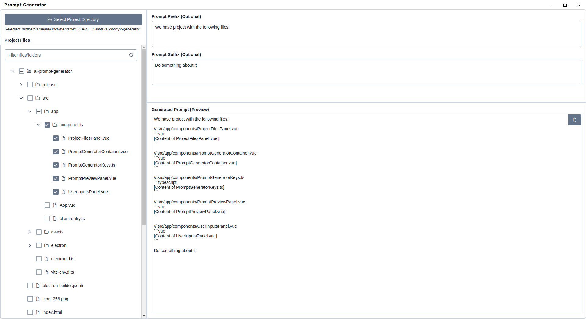

# AI Prompt Generator

Streamline your AI workflow! Select project files, add instructions, and instantly generate context-rich prompts without manual copy-pasting. This desktop application helps you build detailed prompts for Large Language Models (LLMs) by incorporating the actual content of your project files.



## Features

*   **Select Project Directory:** Easily choose a local project folder via the system dialog.
*   **Interactive File Tree:** View a filterable file tree of your project. Common folders (`node_modules`, `.git`, `dist`, etc.) and hidden files are automatically ignored.
*   **File/Folder Selection:** Select multiple files and/or entire folders to include their contents as context in your prompt.
*   **Custom Framing:** Add optional prefix and suffix text to provide instructions or frame the file content for the AI.
*   **Live Preview:** See the structure of your prompt in real-time (using placeholders for file content) as you select files and add text.
*   **Copy Full Prompt:** Generate and copy the final prompt, including the complete content of all selected files, to your clipboard with a single click.
*   **Intelligent File Handling:** Reads text-based files and attempts to skip binary files to avoid irrelevant content. Includes file size limits.
*   **Error Reporting:** Clearly indicates if any selected files could not be read due to permissions or other issues.

## Technology Stack

*   **Framework:** [Electron](https://www.electronjs.org/)
*   **UI Library:** [Vue 3](https://vuejs.org/) (Options API)
*   **Language:** [TypeScript](https://www.typescriptlang.org/)
*   **Component Library:** [PrimeVue 4](https://primevue.org/)
*   **Theming:** PrimeUI Themes (@primeuix/themes/material)
*   **Build Tool:** [Vite](https://vitejs.dev/)
*   **Runtime:** [Node.js](https://nodejs.org/)

## Installation (For Development)

1.  **Clone the repository:**
    ```bash
    git clone https://github.com/olamedia/ai-prompt-generator.git
    ```
    **Navigate to the project directory:**
    ```bash
    cd ai-prompt-generator
    ```
3.  **Install dependencies:**
    ```bash
    npm install
    ```
4.  **Run the development server:**
    ```bash
    npm run dev
    ```
    This will launch the Electron application with hot-reloading for the renderer process.

## Usage (How to Use the Application)

1.  Launch the AI Prompt Generator application.
2.  Click the **"Select Project Directory"** button. A system dialog will appear.
3.  Navigate to and select the root folder of the project you want to use for context.
4.  The file tree for that directory will load in the left panel.
5.  Use the **checkboxes** in the file tree to select the specific files and/or folders whose content you want to include in the AI prompt.
6.  *(Optional)* In the "User Inputs" panel (top-right), enter any introductory text or instructions into the **"Prompt Prefix"** field. This text will appear *before* all the file contents in the final prompt.
7.  *(Optional)* In the "User Inputs" panel, enter any concluding text, questions, or instructions into the **"Prompt Suffix"** field. This text will appear *after* all the file contents in the final prompt.
8.  The **"Generated Prompt (Preview)"** area (bottom-right) shows the *structure* of your prompt in real-time. It includes your prefix/suffix and lists the selected files with placeholders like `[Content of filename.ext]`. This helps you visualize the layout **without** loading all file content constantly.
9.  When you are satisfied with the structure and selections, click the **Copy button** (icon looks like `pi pi-copy`) located next to the preview area.
10. This action reads the *actual content* of all selected files and constructs the complete prompt (Prefix + File1 Content + File2 Content + ... + Suffix). The full prompt is then copied to your system clipboard.
11. Paste the prompt into your preferred AI chat interface or tool.

## Contributing

Contributions are welcome! If you have suggestions or find bugs, please open an issue. If you'd like to contribute code, please feel free to submit a Pull Request.

## License

MIT